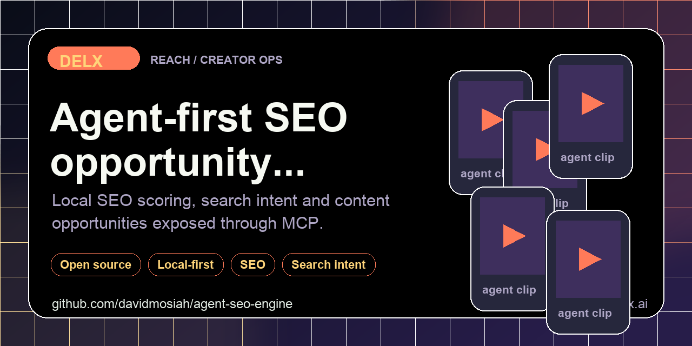

<!-- delx header v2 -->
<h1 align="center">Agent SEO Engine</h1>

<div align="center">
  
</div>

<h3 align="center">
  Local-first SEO scoring, search-intent and opportunity engine for AI agents.<br>Deterministic checks before agents rewrite, refresh or publish content.
</h3>

<p align="center">
  <a href="https://www.npmjs.com/package/agent-seo-engine"></a>
  <a href="https://www.npmjs.com/package/agent-seo-engine"></a>
  <a href="LICENSE"></a>
  <a href="https://modelcontextprotocol.io"></a>
</p>

<p align="center">
  <a href="https://github.com/davidmosiah/agent-seo-engine/stargazers"></a>
  <a href="https://github.com/davidmosiah/agent-seo-engine/actions/workflows/ci.yml"></a>
  <a href="https://github.com/davidmosiah"></a>
  <a href="https://github.com/davidmosiah/agent-seo-engine"></a>
</p>

> ⭐ **If this agent-first tool helps your workflow, please star the repo.** Stars make this tooling easier for other builders to discover and help Delx keep shipping open infrastructure.<br>
> 🧱 Part of the [Delx agent stack](https://github.com/davidmosiah) &mdash; 15 open-source MCP servers across **body, reach and coordination**.

---

<!-- /delx header v2 -->

Agent-first SEO scoring, search-intent detection and opportunity prioritization. It packages the useful parts of a production content pipeline into a clean local CLI plus an optional MCP server for Codex, Claude, Cursor, Hermes, OpenClaw and other agent runtimes.

Use it when an agent needs deterministic SEO checks before rewriting, refreshing or publishing content.

## What It Does

- Classifies search intent: informational, navigational, transactional and commercial investigation
- Scores markdown articles for agent-readable SEO gaps
- Prioritizes GSC-style opportunities by impressions, position, CTR gap, conversions and commercial value
- Exposes `manifest`, `connection_status` and `privacy_audit` surfaces before content tools
- Runs locally by default with no required API keys

## Install

```bash
pipx install agent-seo-engine
```

With MCP support:

```bash
pipx install "agent-seo-engine[mcp]"
```

Published on PyPI: [`agent-seo-engine`](https://pypi.org/project/agent-seo-engine/). Release automation uses PyPI Trusted Publishing, so GitHub Actions can publish future versions without long-lived PyPI tokens. See [docs/pypi-publishing.md](docs/pypi-publishing.md).

## CLI

```bash
agent-seo-engine manifest --client codex
agent-seo-engine doctor
agent-seo-engine privacy-audit
agent-seo-engine intent "best ai agent framework"
agent-seo-engine score --file examples/article.md --primary-keyword "ai agent testing"
agent-seo-engine opportunity --impressions 4200 --clicks 80 --position 12.4 --commercial-intent 0.8
```

All commands return structured JSON by default. Use `--format markdown` for human review.

## MCP

```bash
agent-seo-mcp
```

Hermes-style config:

```yaml
mcp_servers:
  agent_seo:
    command: agent-seo-mcp
    args: []
    sampling:
      enabled: false
```

Recommended first calls:

1. `agent_seo_connection_status`
2. `agent_seo_privacy_audit`
3. `agent_seo_score_content`

## Agent Surfaces

| Tool | Purpose |
|---|---|
| `agent_seo_manifest` | Install/runtime guidance for agent clients |
| `agent_seo_connection_status` | Local/offline readiness and optional integration status |
| `agent_seo_privacy_audit` | Draft, analytics and credential boundaries |
| `agent_seo_detect_intent` | Search intent classification |
| `agent_seo_score_content` | Markdown quality checks with exact recommendations |
| `agent_seo_prioritize_opportunity` | GSC-style opportunity scoring |

## Copy-Paste Agent Prompt

```text
Use agent-seo-engine. First call agent_seo_connection_status and agent_seo_privacy_audit.
Score the draft, then propose only edits tied to failed checks or high-impact opportunities.
```

## Agent Contract

Agents should not guess whether a draft is ready. They should call the scoring tool, read exact failed checks, then propose focused edits. The engine is intentionally deterministic and local so repeated agent runs can compare output over time.

## Development

```bash
python3 -m venv .venv
. .venv/bin/activate
pip install -e ".[dev]"
pytest
python -m compileall -q src
```
